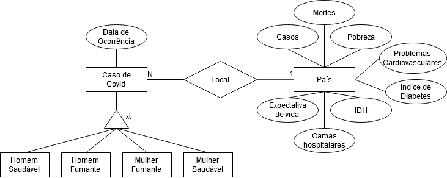

# Aluno
* Gabriel Costa Kinder - 234720

## Tarefa 1 sobre APIs de acesso
> [Notebook](https://github.com/Kinder-Eggs/MC536-2s2021/blob/main/lab01/notebook/lab01-api.ipynb)
## Tarefa 2 sobre Engenharia Reversa
> 
