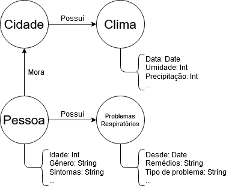

# Aluno
* Gabriel Costa Kinder - 234720

## Modelo Lógico do Banco de Dados de Grafos
> 

## Perguntas de Pesquisa/análise

> Liste aqui as três perguntas de pesquisa/análise
> * Quais são as idades mais afetadas?
> * Qual a relação entre casos e umidade?
> * Existe um aumento de casos em determinada estação do ano?
